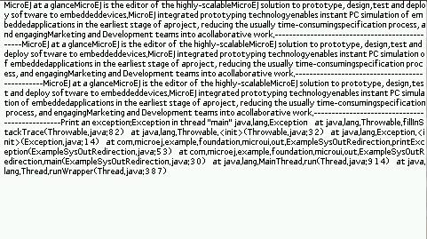

# Overview

This example shows how to do the redirection of the standard SystemOut to the display.

# Requirements

* MICROEJ SDK 6.
* A VEE Port that contains:
  * EDC-1.3 or higher.
  * BON-1.4 or higher.
  * MICROUI-3.6 or higher.

This example has been tested on:

- IntelliJ IDEA with MicroEJ plugin for IntelliJ IDEA ``1.1.0``.
* [STM32F7508-DK VEE Port 2.2.0.](https://github.com/MicroEJ/VEEPort-STMicroelectronics-STM32F7508-DK/tree/2.2.0)

# Usage

Follow [MICROEJ SDK 6 Installation Guide](https://docs.microej.com/en/latest/SDK6UserGuide/install.html) to setup the SDK.

By default, the sample will use the
[STM32F7508-DK VEE Port 2.2.0](https://github.com/MicroEJ/VEEPort-STMicroelectronics-STM32F7508-DK/tree/2.2.0).
The sample retrieves the VEE Port as a [module](https://docs.microej.com/en/latest/SDK6UserGuide/selectVeePort.html#using-a-module-dependency).

## Run on Simulator

Run the following command in your IDE
(or click the ``Play`` button next to the line
below when opening this README in IntelliJ IDEA):

`./gradlew :microui.out:runOnSimulator`

Alternative ways to run in simulation are described in the [Run on Simulator](https://docs.microej.com/en/latest/SDK6UserGuide/runOnSimulator.html) documentation.

## Run on Device

Complete the [Getting Started for STM32F7508-DK Evaluation Kit](https://docs.microej.com/en/latest/SDK6UserGuide/gettingStartedSTM32F7508.html)
to make sure your environment is fully setup.

If you are using another VEE Port, make sure to properly setup the VEE Port environment
before going further. Refer to the dedicated VEE Port README or Getting Started for more information.

Run the following command in your IDE
(or click the ``Play`` button next to the line
below when opening this README in IntelliJ IDEA):

`./gradlew :microui.out:runOnDevice`

Alternative ways to run on device are described in the [Run on Device](https://docs.microej.com/en/latest/SDK6UserGuide/runOnDevice.html) documentation.

## Expected Behavior

The following content can be seen on the screen once the application has started:

# Dependencies

The dependencies defined in [build.gradle.kts](build.gradle.kts)
are configured in [libs.versions.toml](../gradle/libs.versions.toml).

_All dependencies are retrieved transitively by Ivy resolver_.

# Source

N/A

# Restrictions

None.
 
---  
_Markdown_   
_Copyright 2016-2025 MicroEJ Corp. All rights reserved._  
_Use of this source code is governed by a BSD-style license that can be found with this software._ 